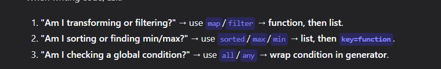

'''
generator -> Expression + Loop + Conditions ( x for x in rage(arr) if x<0)
lambda    -> lambda arguments: functions

map       -> map(functions,iteratble)
filter    ->filter(functions,iterables)
next      ->next( function to get the first occ & exit,default)

sorted    ->sorted(iterables,key=functions)
max       ->(iterables, key=functions)

all,any (are the cherry on top )
✅ Mnemonic:

map / filter → "Function first, data second" → because they apply the function to the data.
sorted, max, min → "Data first, key=second → because you’re acting on the data, and the key is just a helper.

any/all iterables 
'''

nums[a:b] -> a to b-1
nums[a:]  -> a to end 
nums[:b]  -> start to b-1
nums [:]  -> whole array

nums[-a]= ccount from end 
nums[-1:]